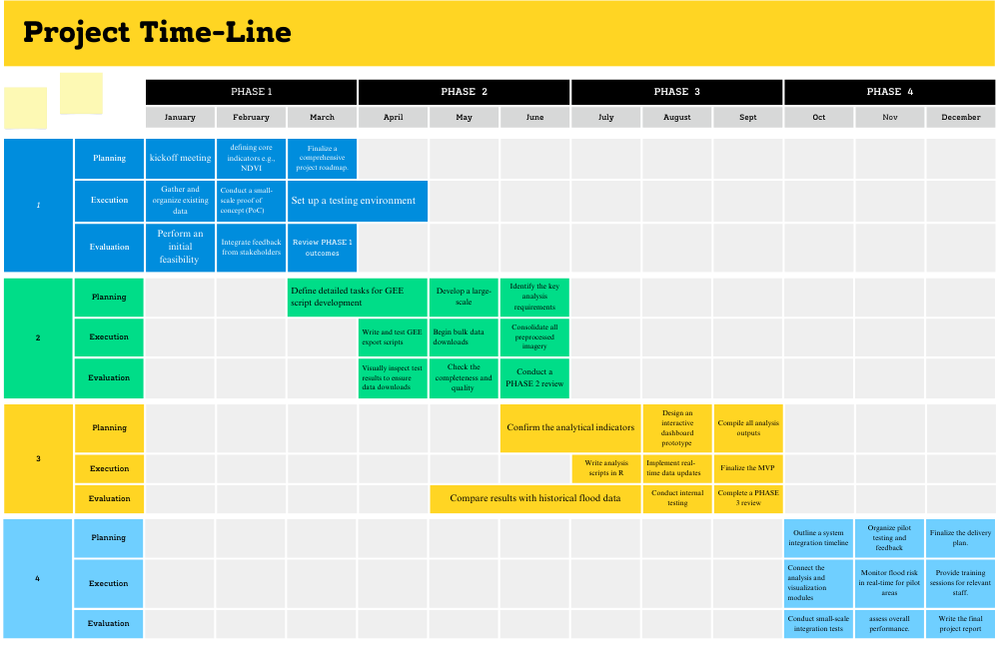

```{r setup, include=FALSE}
knitr::opts_chunk$set(echo = FALSE)

```
part 1
---
Part 2
---
Part 3
---
Introduce of Part 4
---
<h1 style="color:Blue; text-align:center; font-family: 'Times New Roman', serif;">Time Line</h1>

<p style="text-align:center;">
This page outlines the monthly timeline for the Manchester Flood Risk Management project.
</p>


```{r, out.width="100%", fig.align='center'}



```

---

<h1 style="color:blue; text-align:center; font-family: 'Times New Roman', serif;">Project Budget</h1>

<p style="text-align:center;">
Below is the detailed budget breakdown for each module, along with a high-level timeline mapping.
</p>

```{r, out.width="100%", fig.align='center'}
knitr::include_graphics("budget.png")

```
---


