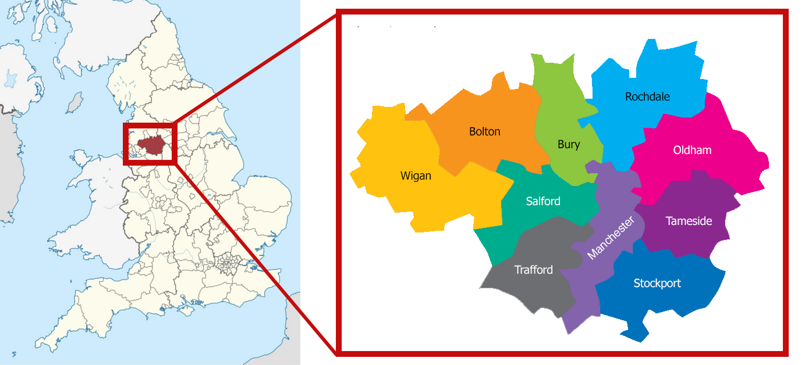
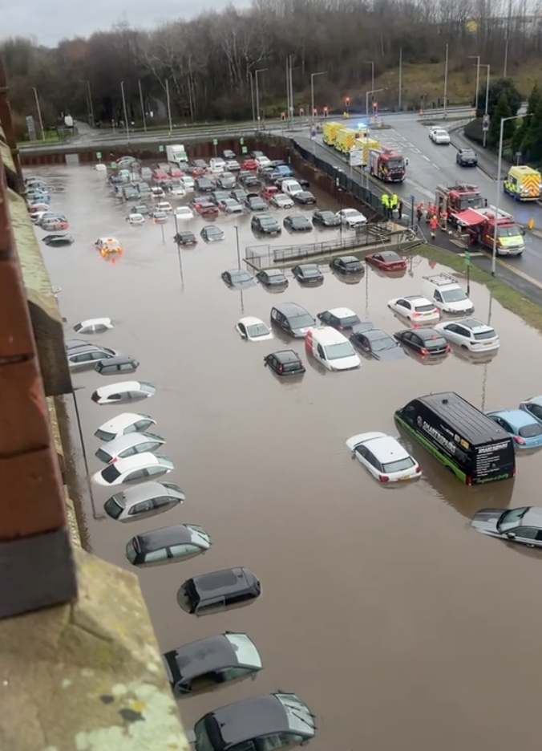
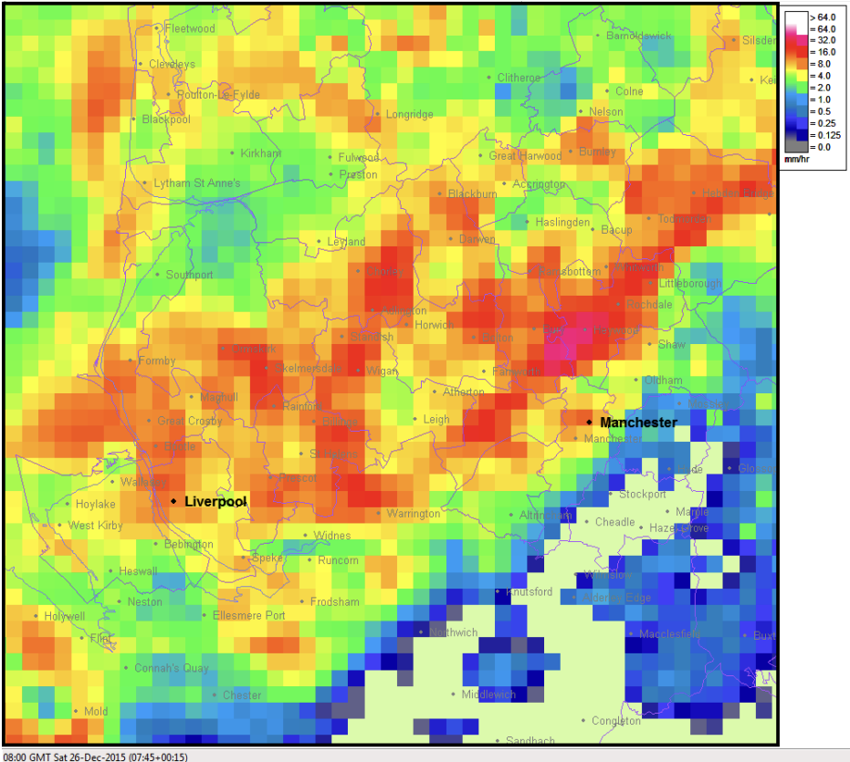
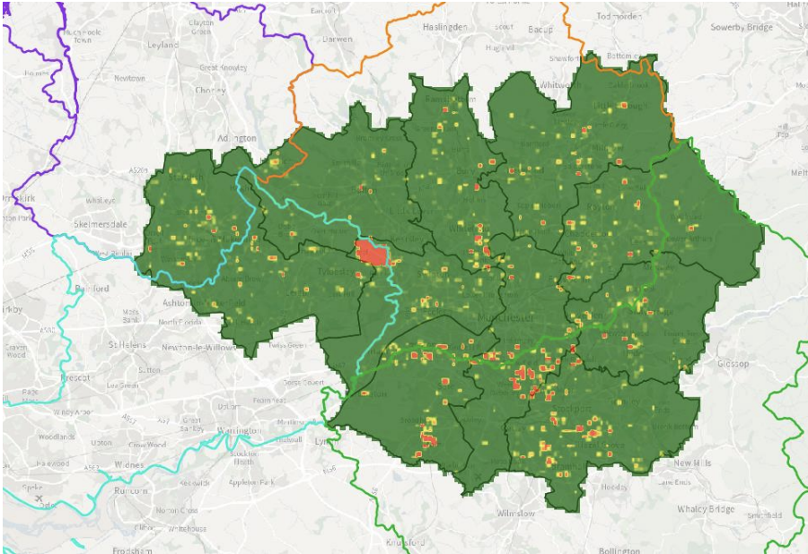
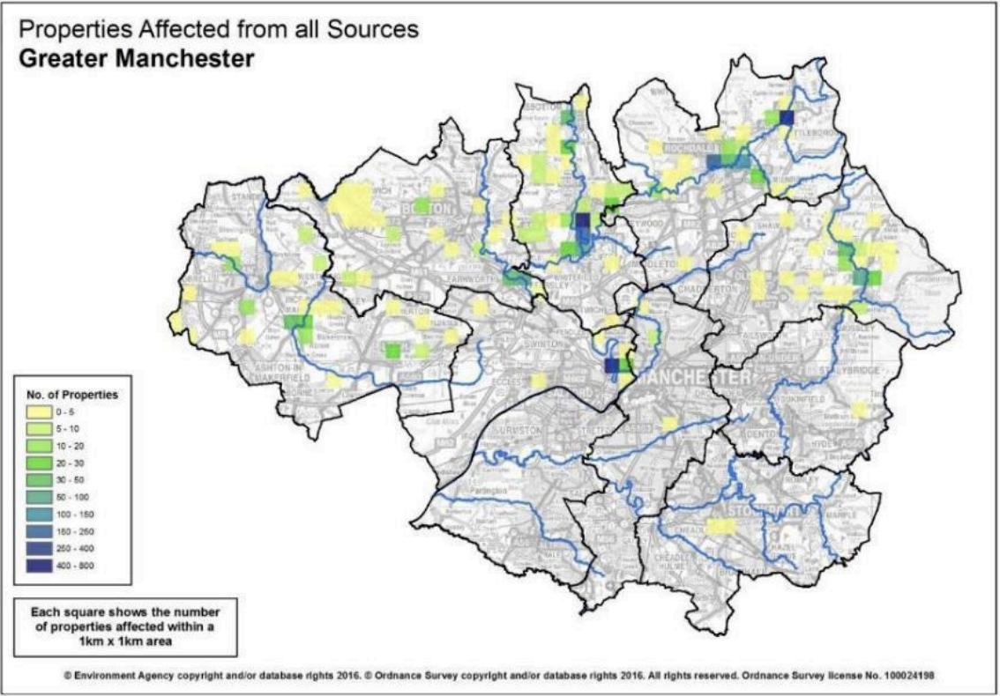
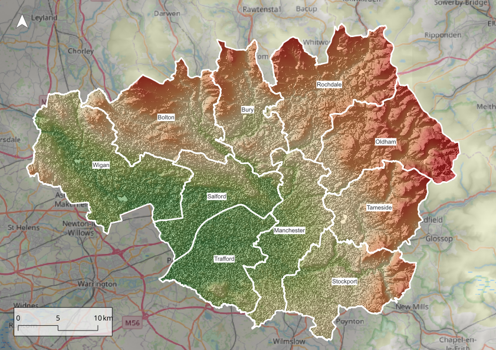
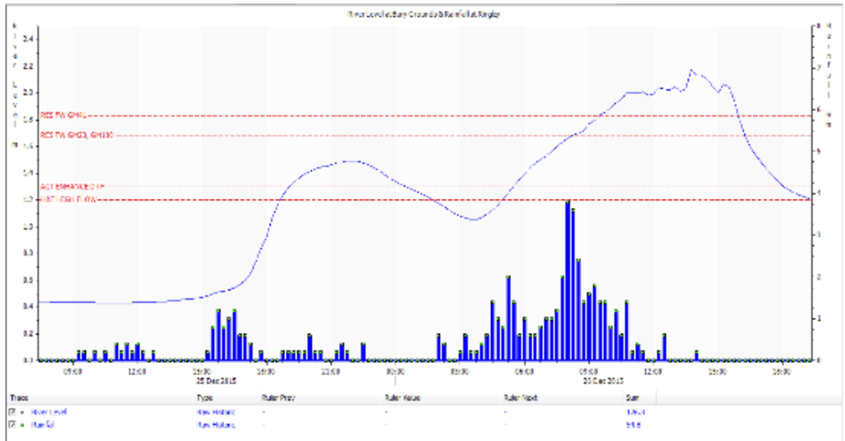
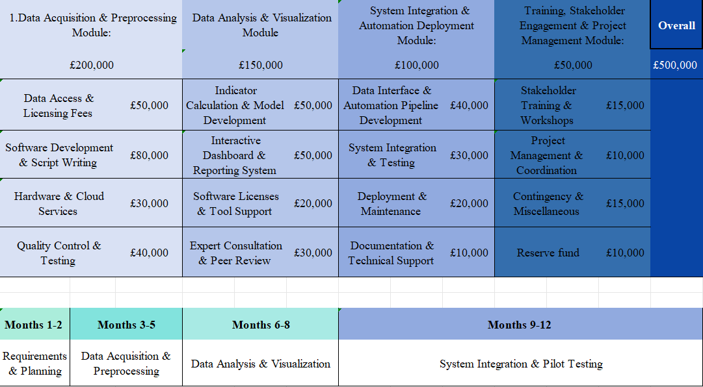

```{r setup, include=FALSE}
options(htmltools.dir.version = FALSE)
knitr::opts_chunk$set(
  fig.width=9, fig.height=3.5, fig.retina=3,
  out.width = "100%",
  cache = FALSE,
  echo = TRUE,
  message = FALSE, 
  warning = FALSE,
  hiline = TRUE
)

```

```{r xaringan-themer, include=FALSE, warning=FALSE}
library(xaringanthemer)
style_duo_accent(
  primary_color = "#1F9FB6",
  secondary_color = "#663399",
  inverse_header_color = "#FFFFFF"
)
```

part 1
---
# Greater Manchester
.pull-left[
- The Greater Manchester consists of 10 regions.

- These 10 regions' council together form the **Greater Manchester Combined Authority (GMCA)**

- These councils work together to solve issues in the region, transport, urban planning.

- The Greater Manchester has a total population of 2.9 million (Census, 2021)

- The region has a Gross Value Added (GVA) of 79 billion pounds which is the largest city region economy outside of London (MIDAS)  
]
  
.pull-right[


```{r echo=FALSE}

```

The 10 regions which form the Greater Manchester:
**Bolton, Bury, Manchester, Oldham, Rochdale, Salford, Stockport, Tameside, Trafford, and Wigan**

]

---
class: inverse center middle

## What are the factors that contribute to Flooding in the Greater Manchester area?
---
# Flooding in Greater Manchester

.pull-left[
- Greater Manchester has experienced significant flooding in recent years out of which the most disastrous one was the **2015 Boxing Day flooding**.

- Historical data suggests that rainfall is one of the **major flood trigger** factors.
  - Whether it be short-duration downpours or prolonged precipitation.

- As the region is highly urbanized, **surface water flooding risk** is also there and this will only increase in the upcoming years if not taken care of.
]

.pull-right[
<div style="text-align: center;">
  
  <p><em>Flooded parking lot due to heavy rainfall on the last New Year's Eve in Greater Manchester (The Manc).</em></p>
</div>
]
---
- **Surface water flooding risk depends on a range of factors** (Greater Manchester Climate Change Risk Assessment, 2024):

  1. Ground conditions (how waterlogged the ground is before a rainfall event)

  2. The extent of impermeable surfaces

  3. Drainage capacity or blocked drains

  4. Topography of the land.
  
- The next important factor is **improper drainage system** due to which if the ground is saturated, then the water has nowhere to go.

- As occurred during the Boxing Day 2015 floods: Storm Eva brought prolonged, **intense rainfall on catchments that were nearly waterlogged**, causing rivers to rise rapidly and overflow.
---
# Rainfall Intensity

.pull-left[
- Heavy precipitation is the dominant meteorological factor in Greater Manchester’s flood risk.

- Cloudbursts and high-intensity rainstorms can overwhelm urban drainage, leading to flash floods.

  - On 25–26 December 2015 up to 128 mm of rain fell within 36 hours in parts of the Irwell catchment north of Manchester
]

.pull-right[
<div style="text-align: center;">
  
  <p><em>Rainfall intensity across Greater Manchester at 8am on Boxing Day.</em></p>
</div>
]
---
# Rainfall Intensity

.pull-left[
- The river level for the River Roch on Boxing Day 2015, at its downstream meeting with the Irwell, was 1.1m higher than anything recorded in its 64-year history.

  - **37 of 44** river gauges in the area recorded their highest levels.
  
- The 2019-2020 floods in the UK, were due to **cumulative rainfall** which was also then recorded as the wettest month to be recorded recently

- Climate projections (UKCP18) anticipate this pattern continuing, with warmer, **wetter winters and more intense downpours expected**.
]

.pull-right[
<div style="text-align: center;">
  
  <p><em>Rainfall intensity across Greater Manchester at 8am on Boxing Day.</em></p>
</div>
]
---
# Drainage Systems & Surface Water Flooding

.pull-left[
- Greater Manchester’s highly urbanized landscape adds another dimension to the flood problem: **impermeable surfaces and drainage capacity**.
  
  -   When heavy rain falls on cities, much of it becomes runoff.
  
- Intense rainfall, when combined with extensive paved areas and limited drainage capacity (or blocked drains), leads to dangerous accumulations of water in low-lying urban spots.

- These low lying areas with the region's old drainage system can create flood hotspots.
]

.pull-right[
<div style="text-align: center;">
  
  <p><em>Surface water flooding hotspot areas (2024).</em></p>
</div>
]
---
class: center middle

## Heavy rainfall exceeding drainage capacity is the cause of urban flash floods
---
class: inverse center middle

## Rainfall is the triggering factor and Drainage capacity is the limitation for Greater Manchester 
---
# Boxing Day 2015

.pull-left[
- 128mm of rain in 36 hours

- 37 of 44 river gauges recorded highest-ever levels

- Three river-flow gauging stations, with flows of around 1,700 m^3/s (1.7 tonnes per second)

- Approx 2000 properties flooded

- 7 Electricity Substations damaged which left 32000 properties without power.
]

.pull-right[
<div style="text-align: center;">
  
  <p><em>Number of Properties affected (1 km x 1 km grid).</em></p>
</div>
]
---
# Boxing Day 2015

.pull-left[
<div style="text-align: center;">
  
  <p><em>Greater Manchester topography map.</em></p>
</div>
]

.pull-right[
<div style="text-align: center;">
  
  <p><em>Number of Properties affected (1 km x 1 km grid).</em></p>
</div>
]
---
## Before and During the Floods
.pull-left[
- The heaviest rains from Storm Eva was experienced mostly in the North of Manchester. 
  
  - In the preceding days, **soils in these areas had become saturated and close to capacity**.
  
- The combination of prolonged average rainfall, saturated catchments, rapidly responding rivers and heavy showers on and around the 26th resulted in an **extremely rapid onset of flooding**.
]

.pull-right[
<div style="text-align: center;">
  
  <p><em>River level (Blue line graph) Irwell and Rainfall (Blue bar graph).</em></p>
</div>
]
---
Part 3
---
<!-- 顶部边框 -->
<div style="position: absolute; top: 0; left: 0; right: 0; height: 4px; background: linear-gradient(90deg, #0056b3 0%, #0083FF 100%);"></div>

 <!-- 固定标题 -->
 <h1 id="main-title">Social Impact Assessment</h1>

 <div class="Social Impact Assessment">

---
5
---
6
---
class: bg2

<div style="
  display: flex; 
  justify-content: center; 
  align-items: center; 
  height: 100%;
">

  <div style="
    background: rgba(0, 0, 0, 0.5);
    padding: 25px 50px;
    border-radius: 15px;
    box-shadow: 0 8px 24px rgba(0,0,0,0.3);
  ">
    <h1 style="
      color: white;
      font-size: 64px;
      text-shadow: 2px 2px 8px black;
      font-family: 'Georgia', serif;
      margin: 0;
      letter-spacing: 1px;
    ">
      Plan To Work
    </h1>
  </div>

</div>

---
class: bg5
---
<html>
<head>
  <meta charset="utf-8">
  <title>Time-line layout</title>
  <style>
  /* 通用样式 */
  body {
    margin: 0;
    /* font-family: 'Times New Roman', serif; */
    line-height: 1.6;
    color: #000000
  }

  /* 固定标题样式 */
  #main-title {
    color: #0077cc;       /* 蓝色 */
    font-weight: bold;    /* 加粗 */
    text-align: center;   /* 居中 */
    font-size: 32px;      /* 适当放大字号 */
    margin-top: 20px;
    margin-bottom: 0;
  }

  /* 时间线容器 */
  .timeline-layout {
    display: flex;
    gap: 20px;
    padding: 30px 20px;
    max-width: 1400px;
    margin: 0 auto;
    margin-top: 20px; /* 与标题稍作间隔 */
  }

  /* 左侧标签栏 - 缩小字体 */
  .left-tabs {
    width: 18%;
    min-width: 180px;
    display: flex;
    flex-direction: column;
    gap: 15px;
    font-size: 14px; /* 缩小字体 */
  }

  .tab {
    cursor: pointer;
    padding: 12px 15px;
    border-left: 2px solid transparent;
    transition: all 0.3s ease;
    color: #666;
    background: #f8f9fa;
    border-radius: 4px;
  }

  .tab.active {
    border-left: 3px solid #0077cc;
    background: rgba(0,119,204,0.08);
    color: #000;
    font-weight: 600;
  }

  .phase-sub {
    display: block;
    margin-top: 5px;
    font-size: 12px;
    color: #888;
  }

  /* 内容框架增大占比 */
  .content-container {
    flex: 1;
    display: flex;
    gap: 40px;
    min-height: 600px;
  }

  /* 文字内容区 - 详细阶段内容 */
  .phase-content {
    flex: 1;
    display: none;
    opacity: 0;
    animation: fadeIn 0.4s ease forwards;
    padding-right: 30px;
  }

  @keyframes fadeIn {
    to { opacity: 1; }
  }

  .phase-content.active {
    display: block;
  }

  /* 新增内容样式 */
  .month-section {
    margin-bottom: 30px;
    padding: 15px;
    background: #fff;
    border-radius: 6px;
    box-shadow: 0 2px 8px rgba(0,0,0,0.05);
  }

  .month-title {
    font-size: 16px;
    color: #2c3e50;
    margin-bottom: 12px;
    padding-bottom: 5px;
    border-bottom: 2px solid #0077cc;
  }

  .section-block {
    margin: 12px 0;
    padding-left: 15px;
    border-left: 3px solid #e0e0e0;
  }

  .section-title {
    font-weight: 600;
    color: #0077cc;
    margin: 8px 0;
  }

  /* 图片区 - 增大占比 + 居中 */
  .image-side {
    flex: 0 0 40%;
    position: sticky;
    top: 20px;
    height: fit-content;
    display: flex;              
    justify-content: center;    
    align-items: center;        
  }

  .image-side img {
    max-width: 100%;           
    height: auto;
    border-radius: 8px;
    box-shadow: 0 4px 12px rgba(0,0,0,0.1);
    border: 1px solid #eee;
  }

  /* 响应式设计 */
  @media (max-width: 768px) {
    .timeline-layout {
      flex-direction: column;
      padding: 20px;
    }
    
   .left-tabs {
      width: 100%;
      flex-direction: row;
      flex-wrap: wrap;
      gap: 10px;
    }
    
   .tab {
      flex: 1 1 48%;
      font-size: 13px;
      padding: 10px;
    }
    
   .content-container {
      flex-direction: column;
    }
    
   .image-side {
      order: -1;
      margin-bottom: 30px;
    }
  }
  </style>
</head>
<body>

 <!-- 固定标题 -->
 <h1 id="main-title">Time-line layout</h1>

 <div class="timeline-layout">
 
  <!-- 左侧标签 -->
  <div class="left-tabs">
   <div class="tab active" onclick="showPhase(0)">
      PHASE 1<br>
      <span class="phase-sub">Months 1–3</span>
    </div>
    <div class="tab" onclick="showPhase(1)">
      PHASE 2<br>
      <span class="phase-sub">Months 4–6</span>
    </div>
    <div class="tab" onclick="showPhase(2)">
      PHASE 3<br>
      <span class="phase-sub">Months 7–9</span>
    </div>
    <div class="tab" onclick="showPhase(3)">
      PHASE 4<br>
      <span class="phase-sub">Months 10–12</span>
    </div>
  </div>

  <!-- 内容区 -->
  <div class="content-container">

  <!-- Phase 1 详细内容 -->
  <div class="phase-content active" id="phase-0">
      <div class="month-section">
        <div class="month-title">January (Month 1)</div>
        <div class="section-block">
          <div class="section-title">Planning:</div>
          <p>• Conduct project kickoff meeting with key stakeholders<br>
             • Clarify goals for flood risk management</p>
        </div>
        <div class="section-block">
          <div class="section-title">Execution:</div>
          <p>• Gather historical flood records<br>
             • Collect geographic boundary data</p>
        </div>
        <div class="section-block">
          <div class="section-title">Evaluation:</div>
          <p>• Initial feasibility check<br>
             • Identify budget constraints</p>
        </div>
      </div>
      <!-- 可以在这里补充 February、March 的类似结构 -->
    </div>

  <!-- Phase 2 详细内容 -->
    <div class="phase-content" id="phase-1">
      <div class="month-section">
        <div class="month-title">April (Month 4)</div>
        <div class="section-block">
          <div class="section-title">Planning:</div>
          <p>• Define tasks for next quarter<br>
             • Resource allocation</p>
        </div>
        <div class="section-block">
          <div class="section-title">Execution:</div>
          <p>• Develop GEE scripts<br>
             • Data cleaning</p>
        </div>
        <div class="section-block">
          <div class="section-title">Evaluation:</div>
          <p>• Check script outputs<br>
             • Document initial findings</p>
        </div>
      </div>
      <!-- 可以补充 May、June 的类似结构 -->
    </div>

  <!-- Phase 3 详细内容 -->
  <div class="phase-content" id="phase-2">
      <div class="month-section">
        <div class="month-title">July (Month 7)</div>
        <div class="section-block">
          <div class="section-title">Planning:</div>
          <p>• Setup NDVI analysis pipeline<br>
             • Confirm study area expansions</p>
        </div>
        <div class="section-block">
          <div class="section-title">Execution:</div>
          <p>• Run NDVI scripts<br>
             • Collect NDVI results for test region</p>
        </div>
        <div class="section-block">
          <div class="section-title">Evaluation:</div>
          <p>• Validate NDVI data<br>
             • Adjust thresholds as needed</p>
        </div>
      </div>
      <!-- 可以补充 August、September 的类似结构 -->
    </div>

  <!-- Phase 4 详细内容 -->
  <div class="phase-content" id="phase-3">
      <div class="month-section">
        <div class="month-title">October (Month 10)</div>
        <div class="section-block">
          <div class="section-title">Planning:</div>
          <p>• Prepare pilot test scenario<br>
             • Finalize deliverables timeline</p>
        </div>
        <div class="section-block">
          <div class="section-title">Execution:</div>
          <p>• Pilot test and gather feedback<br>
             • Address issues found in pilot</p>
        </div>
        <div class="section-block">
          <div class="section-title">Evaluation:</div>
          <p>• Final review<br>
             • Project delivery & sign-off</p>
        </div>
      </div>
      <!-- 可以补充 November、December 的类似结构 -->
    </div>

  <!-- 图片区 -->
  <div class="image-side">
      
    </div>
  </div>
</div>

<script>
// 保持原有Ja增加图片预加载
const images = ["1.png", "2.png", "3.png", "4.png"];
images.forEach(img => new Image().src = img);

function showPhase(index) {
  const tabs = document.querySelectorAll(".tab");
  const contents = document.querySelectorAll(".phase-content");
  const image = document.getElementById("phase-image");

  // 移除所有 active
  tabs.forEach(t => t.classList.remove("active"));
  contents.forEach(c => c.classList.remove("active"));

  // 给点击的 tab 和对应的内容加上 active
  tabs[index].classList.add("active");
  contents[index].classList.add("active");

  // 切换图片
  image.src = images[index];
}
</script>
</body>
</html>

<!-- 顶部边框 -->
<div style="position: absolute; top: 0; left: 0; right: 0; height: 4px; background: linear-gradient(90deg, #0056b3 0%, #0083FF 100%);"></div>

<!-- 底部水印装饰 -->
<div style="position: absolute; bottom: 20px; right: 20px; opacity: 0.1;
     font-family: 'Times New Roman'; font-size: 48px; color:#003366; 
     transform: rotate(-15deg);">
  TIMELINE LAYOUT
</div>

---

<div style="position: relative; width: 100%; height: 100%; overflow: hidden;">

<!-- 顶部边框 -->
<div style="position: absolute; top: 0; left: 0; right: 0; height: 4px; background: linear-gradient(90deg, #0056b3 0%, #0083FF 100%);"></div>

  <!-- 标题区块增强 -->
  <div style="margin: 40px auto 30px; max-width: 1000px; position: relative; z-index: 1;">
    <div style="display: flex; align-items: center; gap: 20px; margin-bottom: 25px;">
      <div style="width: 40px; height: 40px; background: #0056b3; border-radius: 8px; 
           display: flex; align-items: center; justify-content: center;">
        <svg style="width: 24px; height: 24px; fill: white;" viewBox="0 0 24 24">
          <path d="M12 2C6.48 2 2 6.48 2 12s4.48 10 10 10
                   10-4.48 10-10S17.52 2 12 2zm1 15h-2v-6h2v6zm0-8h-2V7h2v2z"/>
        </svg>
      </div>
      <h1 style="color:#003366; margin:0; font-family: 'Times New Roman', serif; 
          font-size: 36px; font-weight: 600; letter-spacing: -0.5px;">
        Strategic Budget Allocation
      </h1>
    </div>

   <!-- 子标题与装饰线 -->
   <div style="border-left: 3px solid #0083FF; padding-left: 20px; margin-left: 60px;">
      <p style="color:#4A5568; font-size: 20px; line-height: 1.4; margin:0 0 15px 0;
         font-family: 'Georgia', serif;">
        Multi-year investment strategy across core capabilities<br>
        <span style="color:#718096; font-size: 16px;">(FY Implementation Roadmap)</span>
      </p>
    </div>
  </div>

<div class="timeline-layout">
  
  <!-- 左边图片区 -->
  <div class="image-side">
    
  </div>

  <!-- 右边文字区 -->
  <div class="phase-content active">
    <h3>Key Investment Areas</h3>
     <ul>
      <li>Infrastructure Modernization (35%)</li>
      <li>R&D Innovation Fund (28%)</li>
      <li>Operational Excellence (22%)</li>
      <li>Talent Development (15%)</li>
    </ul>
  </div>

</div>

  <!-- 底部水印装饰 -->
  <div style="position: absolute; bottom: 20px; right: 20px; opacity: 0.1;
       font-family: 'Times New Roman'; font-size: 48px; color:#003366; 
       transform: rotate(-15deg); z-index: 1;">
    STRATEGIC FINANCE
  </div>

</div>
---
class: center, middle



---
class: thank-bg, center, middle

<h1 style="
  font-size: 64px;
  color: white;
  text-shadow: 2px 2px 8px rgba(0,0,0,0.7);
  font-family: 'Times New Roman', serif;
  font-weight: bold;
  letter-spacing: 1px;
">
  Thank You
</h1>

---
<<<<<<< HEAD
# References
Greater Manchester Combined Authority. Who we are. Available at: https://www.greatermanchester-ca.gov.uk/who-we-are/

About Manchester. Boxing Day floods were the worst ever. Available at: https://aboutmanchester.co.uk/boxing-day-floods-were-the-worst-ever/ 

World Bank (2022). Manchester case study. Available at: https://thedocs.worldbank.org/en/doc/67e70f6cb8dba18f836791e68faa0ac8-0070012022/original/F-Manchester-Case-Study.pdf

Greater Manchester Combined Authority. Greater Manchester Climate Change Risk Assessment Report. Available at: https://www.greatermanchester-ca.gov.uk/media/qtrhgi2y/gm-ccra-report_final.pdf 

---
Greater Manchester Combined Authority. Greater Manchester 5-year environment plan. Available at: https://www.greatermanchester-ca.gov.uk/media/alnl0fsy/gmca_5-year-plan_final_digital_v3-ua.pdf 

Greater Manchester Combined Authority. Greater Manchester Strategy. Available at: https://www.greatermanchester-ca.gov.uk/what-we-do/greater-manchester-strategy/ 

Greater Manchester Combined Authority (2022). Corporate Plan 2022–2025. Available at: https://www.greatermanchester-ca.gov.uk/media/6734/corporate-plan-2022-2025.pdf 

Harrigan, S., Prudhomme, C., Parry, S., Smith, K. and Tanguy, M. (2021). The 2019/2020 floods in the UK: A hydrological appraisal. Hydrology Research, 52(3), pp. 686–704. Available at: https://www.researchgate.net/publication/351377240_The_20192020_floods_in_the_UK_a_hydrological_appraisal

Invest in Manchester. Our economy. Available at: https://www.investinmanchester.com/why-manchester/our-economy/ 

=======
Reference

---
>>>>>>> d57a1705afbf610e60746ee9425532333fc309ab


